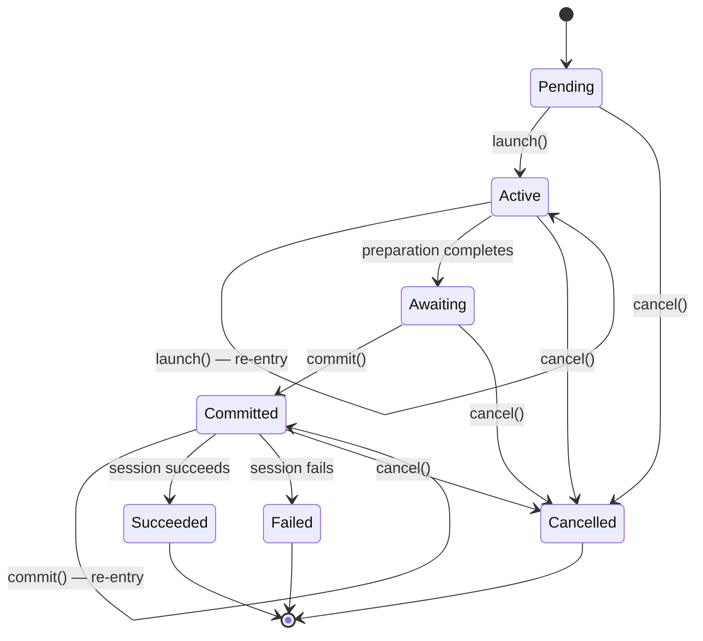
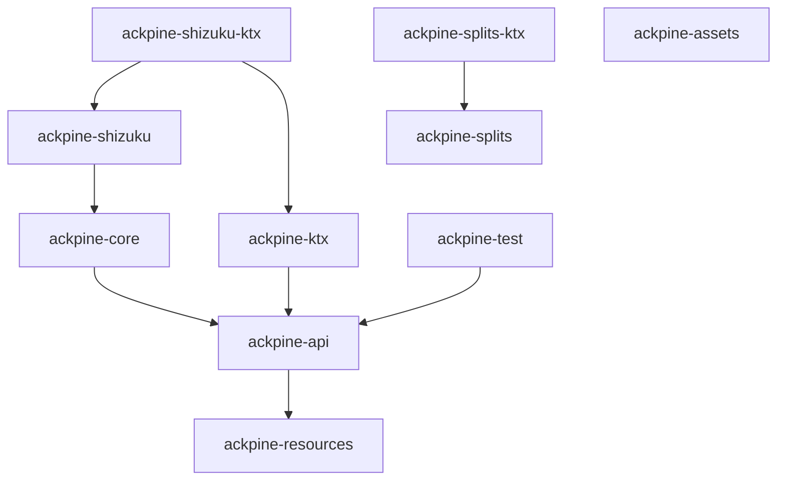

---
hide:
  - navigation
---

Architecture
============

Ackpine library has a concept of [`Session`](/api/ackpine-api/api-main/ru.solrudev.ackpine.session/-session/index.html). `Session` manages the flow of installation or uninstallation process.

One can launch multiple different sessions at once, but can't create them directly. To create a session, one needs to use [`PackageInstaller`](/api/ackpine-api/api-main/ru.solrudev.ackpine.installer/-package-installer/index.html) or [`PackageUninstaller`](/api/ackpine-api/api-main/ru.solrudev.ackpine.uninstaller/-package-uninstaller/index.html).

In essence, `PackageInstaller` is a _repository_ of [`ProgressSessions`](/api/ackpine-api/api-main/ru.solrudev.ackpine.session/-progress-session/index.html), and `PackageUninstaller` is a _repository_ of `Sessions`. They track and persist every session launched.

Session state machine
---------------------

[`Session`](/api/ackpine-api/api-main/ru.solrudev.ackpine.session/-session/index.html) is a finite-state machine which transitions from one [`State`](/api/ackpine-api/api-main/ru.solrudev.ackpine.session/-session/-state/index.html) to another. For transitions to happen, client code needs to react to state changes and call the appropriate methods on the session.

| State         | Terminal | Description                                                                       |
|---------------|----------|-----------------------------------------------------------------------------------|
| **Pending**   | No       | Session has been created but not launched yet.                                    |
| **Active**    | No       | Session is being actively prepared (copying files, requesting preapproval, etc.). |
| **Awaiting**  | No       | Preparation is complete; session is waiting for `commit()`.                       |
| **Committed** | No       | Session is committed; user confirmation is in progress.                           |
| **Succeeded** | Yes      | Installation or uninstallation completed successfully.                            |
| **Failed**    | Yes      | Session completed with an error. Carries a typed `Failure` object.                |
| **Cancelled** | Yes      | Session was cancelled by the client via `cancel()`.                               |

### What triggers each transition

- **Pending → Active**: calling `launch()`.
- **Active → Awaiting**: session finishes its internal preparation (file copying, preapproval request, etc.).
- **Awaiting → Committed**: calling `commit()`, which triggers user confirmation if needed.
- **Committed → Succeeded / Failed**: the system delivers the installation/uninstallation result.
- **Any non-terminal → Cancelled**: calling `cancel()`.

### Re-entrancy for process death resilience

Session by itself is passive — it doesn't do anything until client code says so. This is done to make sessions persistable and suspendable. If any step while the session is active is interrupted (e.g. by process death), it can be re-executed later:

- **Active → Active**: if the preparation process was interrupted, calling `launch()` again re-starts it.
- **Committed → Committed**: if the confirmation was interrupted, calling `commit()` again re-requests it.

The library saves session state to a database, so sessions survive process death. After restart, you re-retrieve the session by its ID and re-attach listeners. See [Handling process death](guide/getting_started.md#handling-process-death) for an example.

### Automating the state machine

The library provides ready-to-use implementations that automate the full session lifecycle:

- [`Session.TerminalStateListener.bind()`](/api/ackpine-api/api-main/ru.solrudev.ackpine.session/-session/-terminal-state-listener/-companion/bind.html) (Java) — automatically calls `launch()` and `commit()` at the right moments and delivers the terminal result via callbacks.
- [`Session.await()`](/api/ackpine-ktx/ru.solrudev.ackpine.session/await.html) (Kotlin, from `ackpine-ktx`) — a suspending function that drives the session to a terminal state and returns the result.

See [Getting Started](guide/getting_started.md#simple-session-launch) for usage examples.

Module dependency graph
-----------------------

| Artifact              | Provides                                                                                               | Depends on                       |
|-----------------------|--------------------------------------------------------------------------------------------------------|----------------------------------|
| `ackpine-api`         | Core API contracts: `Session`, `PackageInstaller`, `PackageUninstaller`, parameters, plugin interfaces | `ackpine-resources`              |
| `ackpine-core`        | Runtime implementation of all API contracts; database persistence                                      | `ackpine-api`                    |
| `ackpine-ktx`         | Kotlin DSL for session parameters; `Session.await()` coroutine extension                               | `ackpine-api`                    |
| `ackpine-splits`      | [Split APK](guide/split_apks.md) utilities: `ZippedApkSplits`, `Apk`, `SplitPackage`                   | Standalone                       |
| `ackpine-splits-ktx`  | Kotlin coroutine extensions for `ackpine-splits`                                                       | `ackpine-splits`                 |
| `ackpine-assets`      | `ContentProvider` for reading APKs from app's asset files                                              | Standalone                       |
| `ackpine-shizuku`     | [Shizuku](guide/shizuku.md)-backed `PackageInstallerService` plugin                                    | `ackpine-core`                   |
| `ackpine-shizuku-ktx` | Kotlin DSL for Shizuku plugin configuration                                                            | `ackpine-shizuku`, `ackpine-ktx` |
| `ackpine-test`        | [Test doubles](guide/testing.md): `TestPackageInstaller`, `TestPackageUninstaller`, scripted sessions  | `ackpine-api`                    |
| `ackpine-resources`   | Abstractions for persistable Android resources: `ResolvableString`                                     | —                                |

!!! Note
    `ackpine-ktx` and `ackpine-test` depend only on `ackpine-api`, not on `ackpine-core`. This means coroutine extensions and test doubles work without pulling in the full runtime.

Plugin system
-------------

Ackpine has a plugin system that allows extending session behavior without coupling `ackpine-core` to concrete plugin implementations.

Plugins implement an internal `PackageInstallerService` interface which wraps Android's `PackageInstaller` behavior.

### Consumer-facing API

- [`AckpinePlugin`](/api/ackpine-api/api-main/ru.solrudev.ackpine.plugability/-ackpine-plugin/index.html) — interface that plugins implement. Each plugin has a unique `id` and typed `Parameters`.
- [`AckpinePluginRegistry`](/api/ackpine-api/api-main/ru.solrudev.ackpine.plugability/-ackpine-plugin-registry/index.html) — interface exposed by parameter builders (`InstallParameters.Builder`, `UninstallParameters.Builder`). Call `usePlugin(pluginClass, parameters)` to apply a plugin to a session.

### Parameters persistence

Plugins can have their own parameters for a session. Plugins implement parameters persistence separately from the main database of `ackpine-core`, so that plugins can maintain independent data persistence schemas and migrations, while also being decoupled from the concrete persistence mechanism.

### Runtime discovery

Plugin service implementations are discovered at runtime via Java `ServiceLoader` (SPI). Each plugin module declares an `AckpineServiceProvider` in `META-INF/services/`. When the first session initializes, it discovers all providers on the classpath and loads their services lazily.

This design means:

- `ackpine-core` never depends on concrete plugin modules — plugins are loaded dynamically.
- Plugin parameters are persisted alongside session data, so sessions with plugins survive process death.
- Adding a plugin to your app is as simple as adding the dependency and calling `usePlugin()` in your parameters.

See the [Shizuku](guide/shizuku.md) page for the currently available plugin and [Configuration](guide/configuration.md#plugins) for usage in parameters.

Design decisions
----------------

### `Uri` as sole APK input type

`Uri` is chosen as the sole input type of APKs. It makes them persistable and allows to plug in any APK source via `ContentProvider`. The library leverages this in `ackpine-splits` and `ackpine-assets` modules to read APKs from zipped files and app's asset files respectively.

### Session passivity

Sessions are deliberately passive — they don't advance their own state. This design makes sessions persistable and suspendable. The tradeoff is that client code must drive transitions (or use the provided `TerminalStateListener` / `await()` helpers). This approach ensures that sessions can be interrupted by process death at any point and seamlessly resumed later.

### `ResolvableString` and `DrawableId` persistence

[`ResolvableString`](/api/ackpine-resources/ru.solrudev.ackpine.resources/-resolvable-string/index.html) and [`DrawableId`](/api/ackpine-api/api-main/ru.solrudev.ackpine.session.parameters/-drawable-id/index.html) values are persisted to a Room database, which creates a problem with Android resource IDs.

Android resource IDs (`R.string.*`, `R.drawable.*`) are generated integers that can change across builds. If a raw ID were stored, it might point to the wrong resource after an app update. To solve this, [`ResolvableString.Resource`](/api/ackpine-resources/ru.solrudev.ackpine.resources/-resolvable-string/-resource/index.html) is abstract — consumers subclass it and override `stringId()` to return the `R.string.*` constant at call time. The serialized BLOB stores the object, and upon deserialization `stringId()` re-reads the current ID from the `R` class, keeping the mapping up-to-date. The same applies to [`DrawableId`](/api/ackpine-api/api-main/ru.solrudev.ackpine.session.parameters/-drawable-id/index.html).

Because Java Object Serialization is used, subclasses need `serialVersionUID` for forward-compatible deserialization, and singletons need `readResolve()` to preserve identity. For strings that are never persisted (e.g. error messages in a ViewModel), `ResolvableString.transientResource()` stores the integer ID directly, avoiding the need for a custom subclass.

See [notifications configuration section](guide/configuration.md#notification) for full code examples.